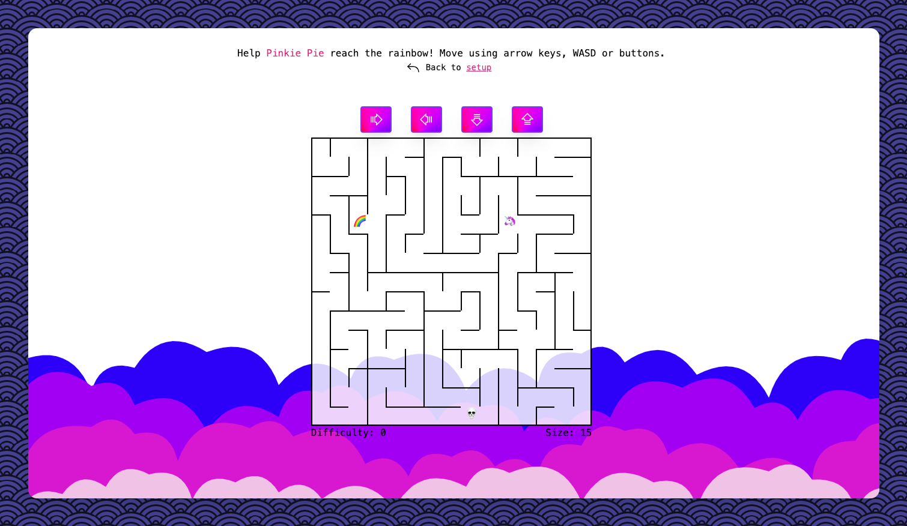

# UNICORN ESCAPE 🦄🦄🦄

Whilst remaining true to the original equine theme, I've decided to give the challenge a mythical spin. The deployed version of the game can be found below. 

➡️ [Unicorn Escape](https://unicorn-escape.surge.sh)

## Scripts

`npm install` to install dependencies 

`npm start` to run app in development mode on [http://localhost:3000](http://localhost:3000)

`npm test` to run tests in interactive watch mode

`npm run build` to build app for production in the `build` folder

## Technology

**Language**: JavaScript  
**Tools**:   

|Tool Name|Function|
|---|---|
|**ReactJS**|to write reusable components|
|**Create-React-App**|to bootstrap React setup and initial folder structure|
|**React-Router-Dom**|to handle client-side routing|
|**React-Testing-Library**|to handle tests (included in CRA setup)|
|**TailwindCSS**|to streamline responsiveness|
|**Axios**|to handle API calls|
|**uuid**|to assign children unique key props|
|**use-sound**|to handle audio|
|**react-hotkeys**|to handle movement via keypresses|
|**react-floaterjs**|to animate images|
|**classnames**|to conditionally render classes|

	    

## Approach 

#### API calls
* handled in `src/API/UnicornAPI.js`, which includes a static API class tying together all methods used to communicate with API
* prevents code duplication and separates concerns

#### Components
* `App` ➡️ `Context Providers`➡️ `Routes`
* `Routes` includes Switch statement to Homepage (`/`), Game Page (`/game`) and Redirect to Homepage in case of typo following base URL
* route `/game` renders `Game` component
* `Game` component uses state to switch between
	* `SetupPage` where user selects game difficulty, maze size & name
	* `MazeWrapper` which includes actual Game
	* `WinPage` where user can start new game and be redirected to homepage
	* `LosePage` as above

#### State management
* state is managed using React's Context API & split into 3 providers: `GameContextProvider`, `AudioContextProvider`, `MoveContextProvider`

#### Maze Rendering
* maze drawing utilises CSS properties `gridTemplateColumns` and `border-top`, `border-bottom`, `border-left`, `border-right`
* API call retrieves grid data array, which is then transformed using helper functions to include additional items `east` and `south` wherever appropriate, as well as `index number`
* transformed grid data array mapped over to render individual `GridCell` components, passing down `borders`, `index` and `sprite positions` as props
* `GridCell` uses props to conditionally render borders & sprites

#### Use of external libraries
I tried to balance the recommended approach of "not reinventing the wheel" with demonstrating my capability to write code independendly. Whilst I leant heavily into external resources to handle movement and sound, I chose to refrain from using an external library and instead demonstrate original code writing in other places, for example in the `Form` component.

## Resources

All resources used are royalty-free.  
Icons: [phosphor-icons](https://phosphoricons.com/)  
SVG background: [bg-jar](https://bgjar.com/)  
Pixel Art: [pinclipart](https://www.pinclipart.com/), [pngkit](https://www.pngkit.com/)  
Conic gradient: [conic.style](https://conic.style/)  
Audio Effects: [mixkit](https://mixkit.co/free-sound-effects/game)

## Limitations

**Testing**: I am aware that the app lacks meaningful integration testing or end-to-end testing. I look forward to levelling up my test game in the future by learning about mocking as well as end-to-end testing libraries such as Cypress. Nevertheless, I hope to have demonstrated a good pre-existing grasp of testing fundamentals, having included unit tests (e.g. in `src/Game/Maze/mazeHelpers.test.js`) as well as smoke tests and snapshots.

## Screengrab 

